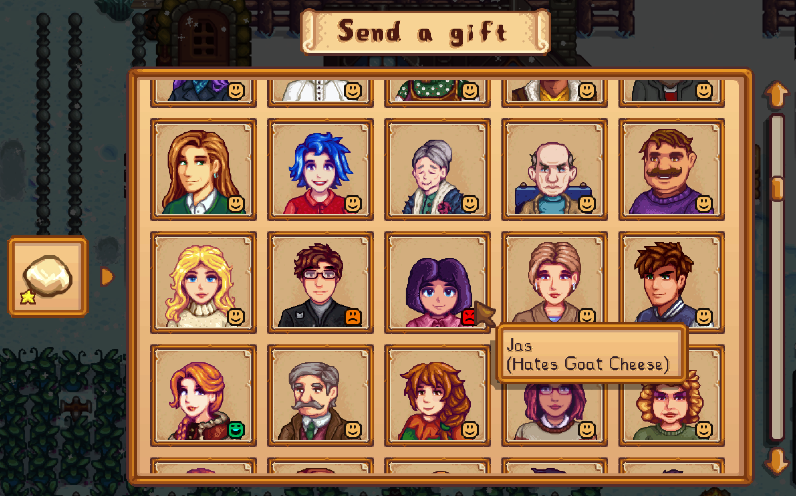

# Stardew Pen Pals

Socialize from the comfort of your own home.



## Introduction

NPCs. Love 'em or hate 'em, but you can't ignore 'em. At least, not if you want Perfection.

- Do you dread Qi's Kindness?
- Do you like to play with 100+ NPCs and literally can't find enough time in 1 week to gift them all (twice)?
- Are you tired of waiting 8 hours for Sam and Sebastian to finally leave their rooms?
- Too busy actually working the farm/mines to run around town larping as Kris Kringle?
- Just thought it was strange and off-putting that your friends can mail _you_ gifts, but you're apparently on some sort of post-office blacklist for outgoing mail?

Not to worry: the Pelican Town Postal Service has you covered. Whatever sins Grandpa committed in the Mesozoic Era have been forgiven, and PTPS is picking up your mail again.

(In other words: Interact with your mailbox while holding an item, and you can mail that item to the NPC of your choice.)

## Installation

Pen Pals follows the standard installation procedure for most mods:

1. Install SMAPI and set up your game for mods, per the [Modding: Player's Guide](https://stardewvalleywiki.com/Modding:Player_Guide/Getting_Started) instructions.
2. Download the [latest release](https://github.com/focustense/StardewPenPals/releases). Make sure you download the `PenPals x.y.z.zip` file, **not** the source code.
3. Open the .zip file and extract the `PenPals` folder into your `Stardew Valley\Mods` folder.
4. Launch the game!

## Features

Pen Pals aims to be another mod that _just works_, without a lot of in-game ceremony. There are essentially two features, one major and one minor.

### Gift Mailing

To open the gifting menu, simply interact with your mailbox under the following conditions:

- You've completed the "How to Win Friends" [story quest](https://stardewvalleywiki.com/Quests#List_of_Story_Quests) (can be disabled in settings)
- Your mailbox is empty, i.e. you've read all incoming mail
- You are holding a [giftable item](https://stardewvalleywiki.com/List_of_All_Gifts) - not a machine, furniture, etc.

Then, click on the portrait of the NPC you want to send to, and confirm your selection. That's it! They'll receive your gift overnight; PTPS is _very_ efficient.

---

A few extra bells and whistles on this page are worth noting:

- By default, emojis will show for gift tastes that are known to your character - if you've given that specific gift to that specific NPC before, or it has been revealed through dialogue or secret notes. If you don't find this "immersive" aspect to enhance your experience, and are just going to look up the gift tastes anyway on the [wiki page](https://stardewvalleywiki.com/List_of_All_Gifts) or with [Lookup Anything](https://www.nexusmods.com/stardewvalley/mods/541), you can change this in the [options](#configuration) to always show the gift taste for every NPC.
- NPCs that can't be gifted for a specific reason (at weekly limit, relationship maxed, etc.) will be grayed out. Hover over their portrait for details.
- NPCs to whom you've already sent a gift on that day will appear with a green-tinted background, as well as an icon showing which gift you sent. These NPCs are **not** disabled; you _can_ select them, but doing so will replace the gift you previously sent (you'll receive the old item back).
- If you've enabled quest deliveries in the [Settings](#settings) (enabled by default), an additional overlay will be shown for each NPC with a pending quest; hovering over this will show which quest, and what item is required.
- NPCs with birthdays will display a small balloon. Birthday indicators incorporate your Mail Schedule [setting](#settings); if you choose Next-Day delivery, the indicator will show for NPCs with birthdays tomorrow instead of today.
- If you have a lot of NPCs, click on the magnifying class next to the "Send a gift" banner to open up additional filters. You can filter by name, gift taste/reaction, quests (if enabled) and birthdays.

### Returns

So, you thought you could use the "overnight" system as an exploit to cheat the normal gifting rules? You've been a naughty boy/girl. Fortunately, Pen Pals isn't going to outright _punish_ you for such cheap chicanery, but PTPS follows the rules even if you don't, and if an NPC is determined to be non-giftable _at the time they are due to receive their gift_, then it will be returned to you by mail.


*(Note: The "immersive" default is to not show the "refused because:" line, but if you prefer gameplay over raw realism, you can turn this on in the mod settings.)*

## Balance

***Nerd Alert:** If you just want to play, and don't care about balance or implicitly trust modders to get it right, then you don't need to read this section. It's here for those who are genuinely curious about why some of the specific choices were made, and what you can expect to happen if you fiddle with the balance settings.*

---

It is impossible to introduce any new mechanic without affecting game balance in some way; however, the goal of the mod in its default configuration is to leave a _minimal_ footprint on your normal priorities, such that as long as you plan ahead, it is possible (but _not easy_) to max all relationships at the end of Year 1 without re-orienting the entire game around it, e.g. repeatedly wasting max-luck days to run around town.

Pen Pals is meant to help keep the relationship progression going during periods of intense gameplay activity (catfishing, cavern dives, etc.) so that you can continue to focus on those (fun) things without getting Perfection-blocked in Winter Y1 for no reason other than weekly gift limits -- but also not to enable players to ignore NPCs/relationships entirely and cheese their way to Great Friends. We are not anti-social, merely anti-_stalking_.

The two ways this mod aims to preserve balance are (1) progression and (2) scaling.

### Progression

Put simply: You can't mail gifts to villagers you haven't met, and the gift menu won't reveal anything about them; they will not be displayed at all. Thus, you must still make _some_ time to actually physically meet everyone, and must do it in the relatively early game, necessitating the same trade-offs between foraging, fishing and socializing.

Since you typically won't have many Loved gifts to send during the first few weeks of play anyway, there is no reason to further delay progression, although leaving on the option to require completion of "How to Win Friends" is still recommended for narrative consistency.

### Scaling

The real balance of this mod comes from point scaling, and while players may change the scale to suit their preferences, the recommended value is the default value of 0.6.

Why exactly 0.6? Because this enables you to gain only 1920 friendship points in one game year by mail using base quality Loved gifts and sending them twice a week plus birthdays. That falls significantly short of the 2500 needed for maximum hearts - or 2756 assuming max decay. Even with all gifts being Iridium quality (which you will not have early on, and for some NPCs will struggle to obtain even much later), the maximum would be 2880, which only barely exceeds the required 2500 and is not practically achievable in the first year.

Mailed gifts are there to _supplement_ your in-person gift giving during periods where it would be wildly impractical to wander around the map. To actually reach max friendship in a year will still require several in-person gift visits, attending heart events and certain festivals, picking appropriate dialogue choices, etc. The default scaling should make it very challenging to max every villager in the first year, but not outright impossible as it generally is with vanilla mechanics/routing.

If you hate the socialization aspect of the game and see it as an unnecessary obstacle on the path to Perfection, or an initially cute and heartwarming aspect of the game that ceased to be cute and heartwarming after the 84th repetition, then feel free to bump the scale all the way up to 1.0 and go Full Hermit; I salute you. Keep in mind that there are certain progression items (crafting, recipes) gated behind relationships, and using a high scale will affect the overall progression in some less-than-subtle ways.

Conversely, if you got here because you _love_ NPCs and are continuously adding more of them and simply cannot get to them all, and only want to use gift-mailing as an emergency backup for "oh no, I forgot it was so-and-so's birthday today and it's 12:30 am and I _really_ don't want to restart the day" moments, and you have no interest in attempting Y1 Perfection or even Y1 Max Hearts, then feel free to adjust the scale _down_. There is no harm in doing so, and it won't break any vanilla balance because it is an optional add-on.

**Note:** Pen Pals adds one unique twist to the scaling: only _positive_ results are scaled down. If you mail disliked or hated gifts, you will lose the same points that you'd lose face-to-face. After all, wouldn't _you_ be upset if metaphorical Santa left a lump of coal in _your_ metaphorical stocking?

## Configuration

All of this mod's options are configurable through GMCM. If you prefer to edit the `config.json` or are having any trouble with the in-game settings, read on for a detailed explanation of what the settings do.

<details>
<summary>Example Configuration</summary>

```json
{
  "DetailedReturnReasons": false,
  "FriendshipMultiplier": 0.6,
  "GiftTasteVisibility": "Known",
  "RequireConfirmation": true,
  "RequireQuestCompletion": true,
  "Scheduling": "SameDay",
}
```
</details>

### Settings

* `DetailedReturnReasons`: Whether to show the exact reason why a gift was returned in the [return mail](#returns). Valid values are `true` or `false`.
* `EnableQuests`: Whether to allow quests to be completed by mail. Also controls whether quest options and indicators show in the gift menu.
* `FriendshipMultiplier`: Scales down the friendship gain when a gift is mailed, compared to an in-person gift. This can be any numeric value, but see [Balance](#balance) for details.
* `GiftTasteVisibility`: When to show gift tastes for NPCs in the gift-mail menu. Valid values are:
  * `All` - always show gift tastes for all combinations of NPC and gift item regardless of game progression. Recommended for veteran/challenge players unconcerned about spoilers.
  * `Known` - only show gift tastes that would also be visible on the NPC's profile page, i.e. those discovered through previous gifting or via dialogue, Secret Note, etc.
  * `None` - never show gift tastes. For those who are way past "veteran" and have every gift taste memorized, and don't want the emojis cluttering up the UI.
* `QuestFriendshipMultiplier`: Scales down the friendship gain when a quest is completed by mail, compared to an in-person delivery. This can be any numeric value, but see [Balance](#balance) for details.
* `RequireConfirmation`: Display a confirmation dialog before posting a gift. Helpful to prevent accidental misclicks. Default is `true`, change to `false` if the dialog is interrupting your flow/immersion.
* `RequireQuestCompletion`: Gift mail menu will not show up when interacting with the mailbox until completion of the "How to Win Friends" quest, which requires first meeting everyone in town (to receive the quest) and gifting at least one NPC in person.
  * Note that regardless of this setting, NPCs whom you haven't met yet will _not_ be available for gifting. You may want to set this to `false` if you play with hundreds of NPCs and completing the above quest is actually very difficult, but you still can't mail gifts to strangers. *(For example: how would you know their address?)*

* `Scheduling`: Can be either `"SameDay"` (default) or `"NextDay"`. In both cases, NPCs will receive their gifts after you go to sleep or pass out, but:
  * `SameDay` means NPCs will receive their gifts _before_ the calendar date rolls over to the next day; i.e. on the same date the mail was posted. This is easier to understand and work with: the rules for mailed gifts are identical to the rules for face-to-face; gifts sent on the NPC's birthday will receive the birthday bonus; and so on. However, it is not very realistic for someone to be opening their mail at 3 AM, never mind a postal carrier delivering it at that time, and some players may find this awkward or immersion-breaking.
  * `NextDay` means NPCs will receive their gifts _after_ the calendar date rolls over, i.e. on the next morning, which is the same time you would check your own mail and receive one of theirs. However, it is more challenging because it requires planning ahead: birthday gifts must be sent on the day _before_ an NPC's birthday in order to get the bonus; gifting-related quests may expire before the final gifts go out; and the "mail gifting" week restarts on Saturday, since the gift would actually be received on Sunday.
  * Choose based on your personal preference for gritty realism vs. intuitive gameplay.


## See Also

* [Changelog](CHANGELOG.md)
